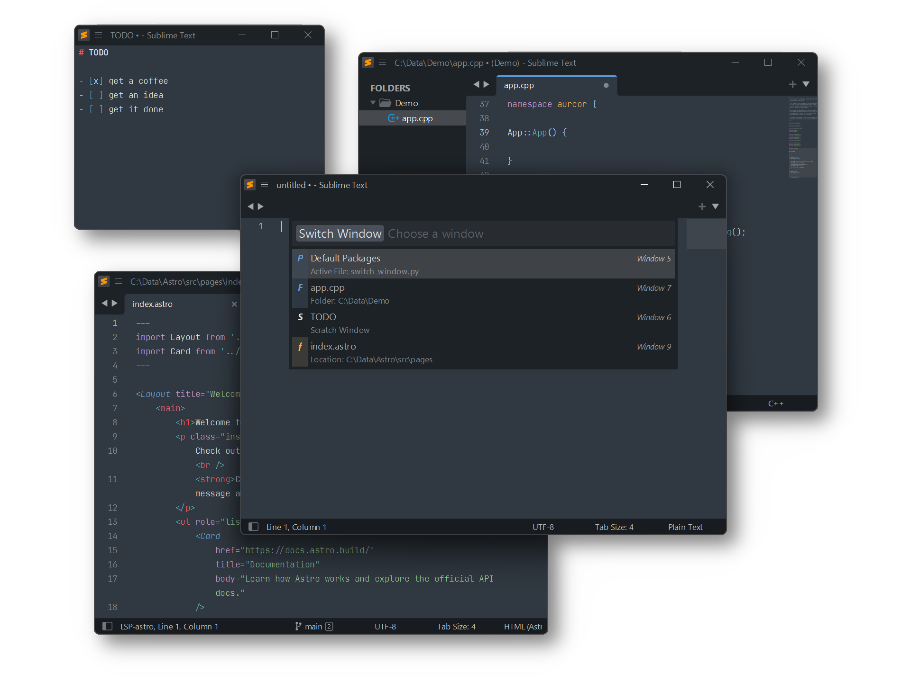

# Switch Window

A Sublime Text plugin to quickly switch between open Sublime Text windows
via Command Palette without having to press <kbd>command ~</kbd> (MacOS)
or <kbd>alt+tab</kbd> (Linux/Windows) repetitively.



## Installation

### Package Control

The easiest way to install is using [Package Control](https://packagecontrol.io). It's listed as `Switch Window`.

1. Open `Command Palette` using <kbd>ctrl+shift+P</kbd> or menu item `Tools → Command Palette...`
2. Choose `Package Control: Install Package`
3. Find `Switch Window` and hit <kbd>Enter</kbd>

### Manual Install

1. Download [Switch Window.sublime-package](https://github.com/SublimeText/SwitchWindow/releases).
2. Rename downloaded file to `Switch Window.sublime-package` _(by removeing intermediate period)_
3. Copy it into _Installed Packages_ directory

> [!NOTE]
> 
> To find _Installed Packages_...
>
> 1. call _Menu > Preferences > Browse Packages.._
> 2. Navigate to parent folder

> [!WARNING]
>
> Package Control doesn't update manually installed packages.

### Clone git repository

You can clone this repository into your _Sublime Text/Packages_

> [!NOTE]
>
> To find _Packages_ folder call _Menu > Preferences > Browse Packages..._

##### Mac OS

```shell
cd ~/Library/Application\ Support/Sublime\ Text/Packages/
git clone https://github.com/SublimeText/SwitchWindow.git "Switch Window"
```

##### Linux

```shell
cd ~/.config/sublime-text/Packages
git clone https://github.com/SublimeText/SwitchWindow.git "Switch Window"
```

##### Windows

```shell
cd "%APPDATA%\Sublime Text\Packages"
git clone https://github.com/SublimeText/SwitchWindow.git "Switch Window"
```

> [!NOTE]
>
> Package Control updates cloned packages only,
> if `ignore_vcs_packages` setting is `true`
> or does not contain "Switch Window".

## Usage

1. Open `Command Palette` using <kbd>ctrl+shift+P</kbd> or menu item `Tools → Command Palette...`
2. Type `Window: Switch Window` and hit <kbd>enter</kbd>

or hit <kbd>ctrl+k</kbd>, <kbd>ctrl+tab</kbd> in sequence
to show the `Switch Window` Quick Panel directly.

## Kind Info

The kind of a window is displayed via icon.

| icon | description
|:----:|:---
| P    | A project/workspace is opened in the window
| F    | One or more folders are opened in the window. The best matching one according to the active file is displayed in description line.
| f    | A file is displayed in active view of a window, which has no project or folder open.
| S    | An unsaved view is displayed in active view of a window, which has no project or folder open.